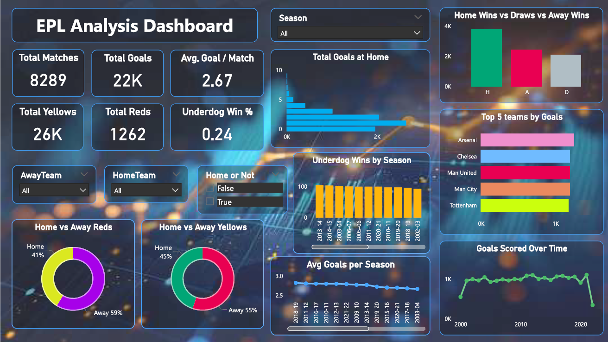

# ⚽ EPL Data Analysis & Dashboard

## 📌 Project Overview
This project focuses on performing **Exploratory Data Analysis (EDA)** on the **English Premier League (EPL) dataset** (sourced from Kaggle).  
The main goal was to extract insights into team performances, player statistics, and match outcomes, followed by building an **interactive dashboard** for visualization.

---

## 🎯 Objective
- Perform end-to-end data analysis on EPL match data (1993–2022)  
- Clean, explore, and visualize key statistics  
- Engineer new features like **Match Intensity** and **Aggressiveness**  
- Train machine learning models to predict match results  
- Deliver compelling insights through visuals and storytelling  

---

## 📊 Tech Stack
- **Python (Pandas, NumPy, Matplotlib, Seaborn)** → Data cleaning & EDA  
- **Google Colab** → Notebook development  
- **Power BI** → Dashboard creation  
- **Google Slides** → Final presentation  

---

## 🔎 Exploratory Data Analysis
Key steps performed:
1. Data cleaning (handling null values, formatting columns).  
2. Statistical summaries and distributions.  
3. Visualizations (bar charts, heatmaps, goal distributions).  
4. Comparative analysis of **Home vs Away performances**.  

---

## 🏟️ Dashboard
The dashboard highlights:
- Total Goals (Home & Away)  
- Wins, Losses, and Draws distribution  
- Top performing teams 
- Match outcome trends  

---

## 📂 Repository Structure
├── EPL_Analysis.ipynb # Jupyter/Colab notebook with EDA
├── EPL_Dashboard.pbix # Power BI dashboard file
├── EPL_Dashboard.png # Dashboard snapshot
├── Presentation.pptx # Project presentation
└── README.md # Project documentation

---

## 📌 Key Insights
- Home teams scored significantly more goals compared to away teams.  
- Certain teams consistently dominated across multiple seasons.  
- The distribution of draws was lower than wins/losses, showing competitive outcomes.  
- Goals scored trend indicated increasing attacking playstyles over seasons.
- Home advantage exists but is narrowing in modern seasons
- Shots on target and discipline metrics are strong predictors of match outcome
- Referee behavior significantly affects match dynamics
- ~13% of matches are won by teams with fewer shots — underdog victories
- Custom metrics like Match Intensity Score reveal deeper game dynamics  

---

## 🎯 Conclusion

The EPL exhibits a slight home advantage, though it's decreasing.
Discipline, shots on target, and referee behavior significantly affect outcomes.
ML models can predict outcomes with fair accuracy using basic stats.
Custom metrics like Match Intensity reveal hidden game dynamics.

---

## Recommendations:

Use data analytics for team strategy refinement
Explore player-level or positional data for deeper insights

## 👨‍💻 Author

Kamal Aggarwal
Connect with me on LinkedIn - https://www.linkedin.com/in/kamal-aggarwal-18923127a?lipi=urn%3Ali%3Apage%3Ad_flagship3_profile_view_base_contact_details%3BtGJZZ6WKRJq7m9zIgsBXzg%3D%3D 
